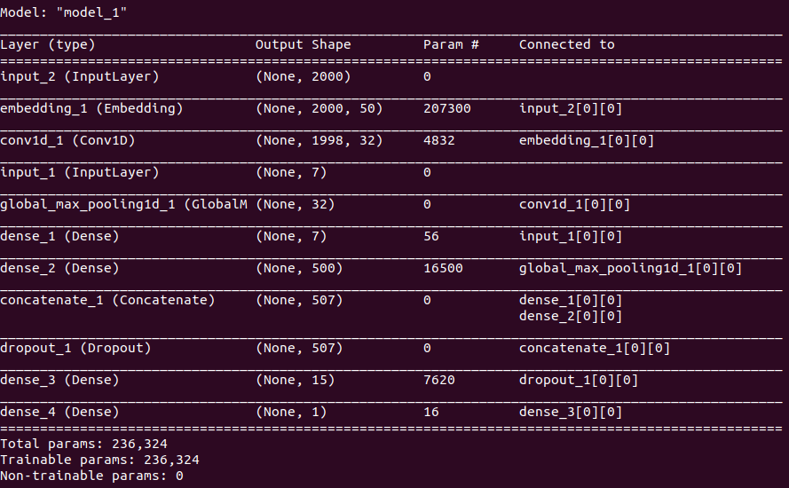
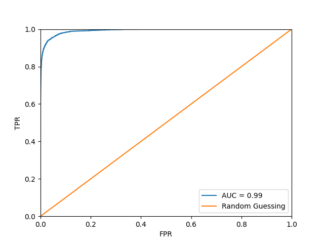
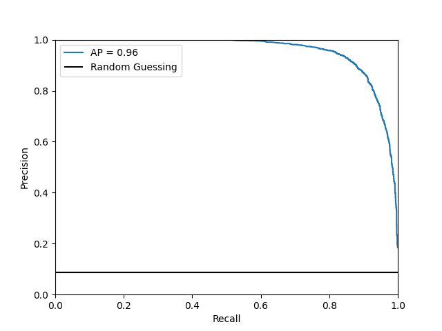
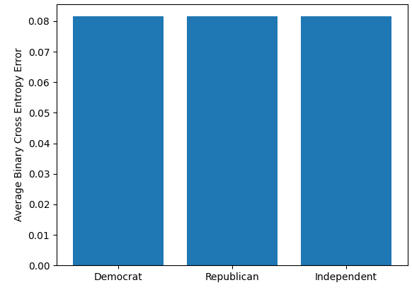
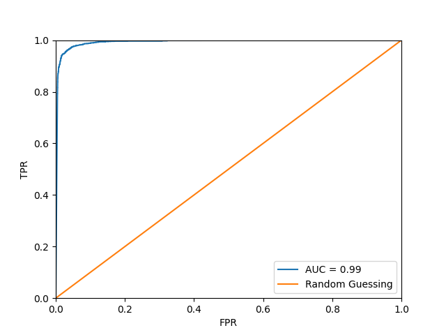
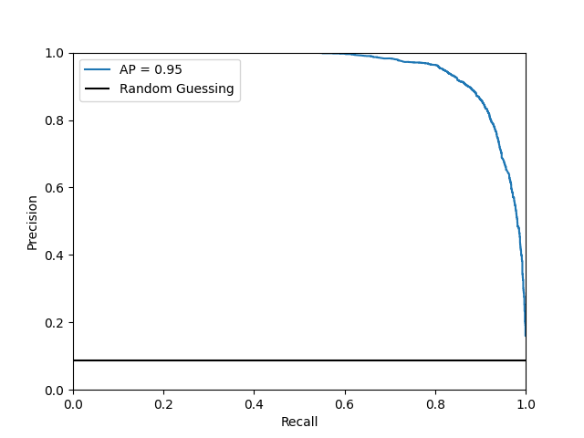
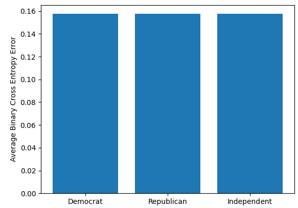

# Bill Predictor
Attempt at predicting outcomes of bills in the U.S. Congress  

__Usage:__  
Full pipeline:  
python3 getCongressChar.py -instances 98 116 -data data/  
Check for discrepancies with https://en.wikipedia.org/wiki/United_States_Congress  

python3 processJSON.py -data data/ -cong_data data/congress_mem_char.json  
python3 learnChamber.py python3 learnChamber.py data/senate.csv models/senateModel -epochs 10 -learning_rate .001 -batch_size 2048 -max_len 2000  

Prediction:  
python3 predictChamber.py data/predictMe.csv data/output.csv model/senateModel  
Make sure csv follows format of example in prediction notebook or training data in data/{chamber}.csv  
Also make sure to insert {"key": "{key here}"} into api_key.json or specfiy location.  The free api key is available at https://www.propublica.org/datastore/api/propublica-congress-api       

Or use currentPredictions notebook to see predictions on the 20 most recent active bills in the house and senate.  

__Packages__:  
requests  
argparse  
tqdm   
pandas  
keras  
tensorflow  
numpy  
sklearn  

__Performance__:  
Model Architecture  
 
House Model:  
 
 
 

Senate Model:  
 
 
 
